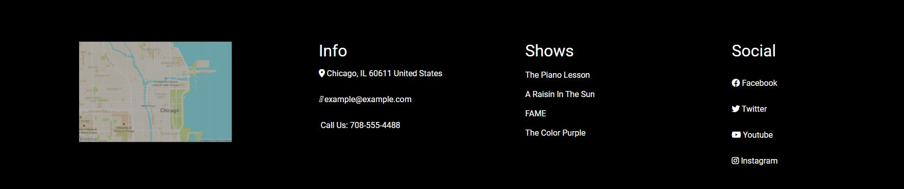

# Theatre Company Website
> Given a screenshot of theatre company website, I created a mockup using HTML
and CSS flexbox to replicate the screenshot.

## Table of Contents
* [General Info](#general-information)
* [Links](#links)
* [Technologies Used](#technologies-used)
* [Screenshots](#screenshots)
* [Project Status](#project-status)
* [Room for Improvement](#room-for-improvement)
* [Contact](#contact)

## General Information
The task for this project was to practice using CSS Flexbox. For this project,
I was given a screenshot of a mockup of a theatre company website. The task was
to replicate the mockup using just HTML and CSS. Flexbox was used to display the
footer information in a row and the show dates in a column, with each show date 
being displayed in a row with an image, show details, and a button.

## Links
- Live Demo URL: [https://marlisarebaum.github.io/theatre-company/](https://marlisarebaum.github.io/theatre-company/)

## Technologies Used

## Screenshots

#### Flexbox Row and Columns Used for Show Dates:

#### Flexbox Row and Columns Used for the Footer:

## Project Status
Project is:  _complete_ 

## Room for Improvement
Since the task for this project was to just create a replica of a provided screenshot,
the given task was completed successfully.

However, some improvements could be:
- Use CSS Flexbox not just to display rows and columns, but to make the site responsive.
- Make the map in the footer interactive so when clicked, the user is able to 
open Google maps to nativate to the theatre.
- Impove the layout of the footer - currently the links are not very aligned and
the spacing is uneven.
- Use a mailto: href for the email in the footer to allow users to send an email
by clicking the link.
- Make the "read more" buttons clickable and link to relevant information on the site.

## Contact
Created by [Marlisa Rebaum](https://www.linkedin.com/in/marlisarebaum/) - feel free to contact me!